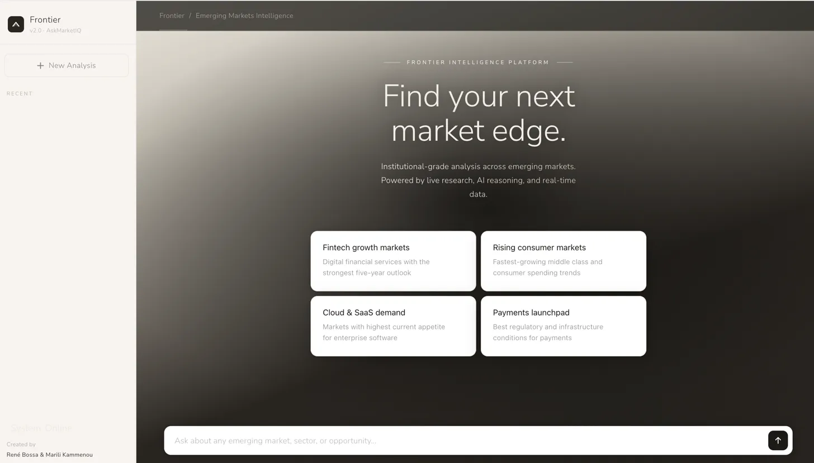
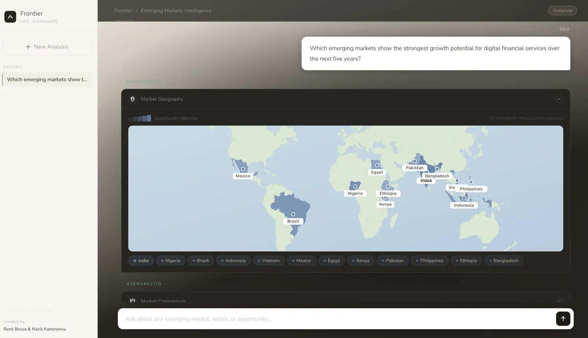
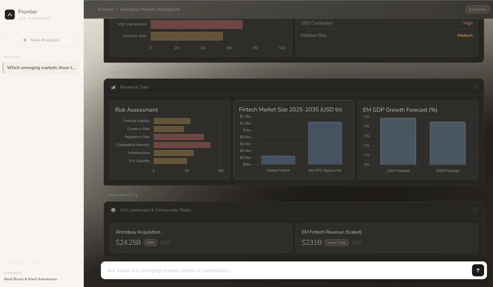
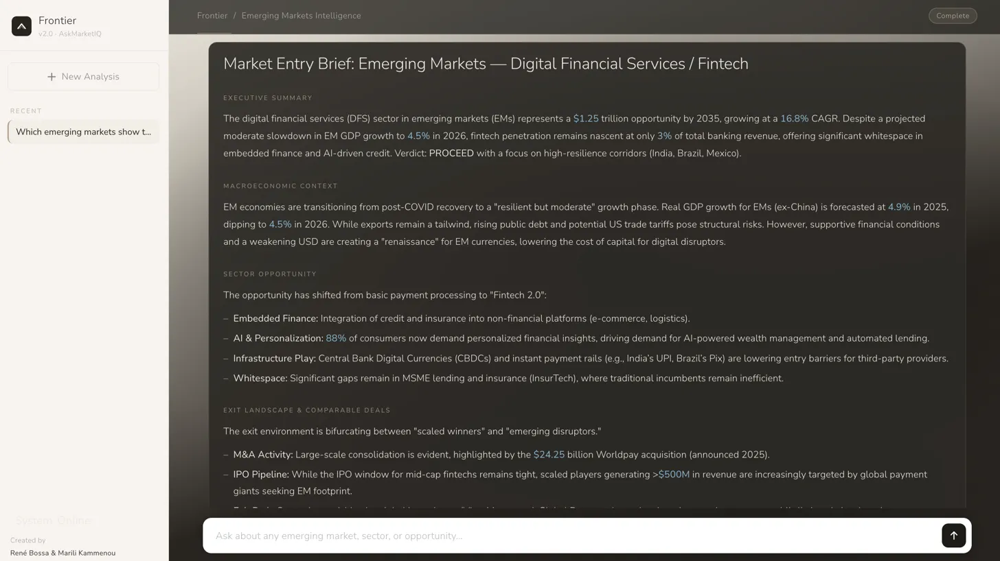

[README.md](https://github.com/user-attachments/files/27447467/README.md)
# Frontier — Emerging Markets Intelligence Platform

> *Built for people who don't just analyse markets — they anticipate where they're going next.*

**Frontier** is an institutional-grade emerging markets intelligence platform. Submit a natural language query about any market, sector, or opportunity — and receive a structured brief with charts, FX analysis, market timing signals, comparable deals, and a PDF export. In under 30 seconds.

Built by **René Bossa & Marili Kammenou** · AskMarketIQ

---

## Screenshots

**Landing screen**


**D3 choropleth map — market geography**


**Research data — risk assessment, market size, GDP forecast**


**Market entry brief — structured prose output**


---

## What it does

- **Six-node parallel research pipeline** — macro, political risk, sector opportunity, exit landscape, FX/currency, and market timing all run simultaneously via LangGraph
- **AI-driven synthesis** — Google Gemini produces a structured market brief, not a list of links
- **Live web search** — Tavily fetches real-time data for every query
- **Smart router** — simple/definitional queries answered directly (2–3s); complex analysis queries trigger the full pipeline (~25s)
- **Rich frontend** — D3 choropleth heatmap, Chart.js data panels, market timing curve, FX risk charts, comparable deals, and one-click PDF export
- **Conversation memory** — follow-up questions are context-aware across the session

---

## Repo structure

```
frontier/
│
├── README.md               ← You are here
├── .env.example            ← Copy to .env and add your API keys
├── requirements.txt        ← Python dependencies
│
├── api.py                  ← FastAPI server with streaming NDJSON endpoint
├── graph.py                ← LangGraph pipeline definition
├── nodes.py                ← All 8 pipeline nodes (parse → research × 6 → brief)
├── router.py               ← Pre-pipeline classifier (direct / pipeline / out_of_scope)
├── state.py                ← AgentState TypedDict
├── tools.py                ← Stub data tools (swap for real APIs in production)
├── main.py                 ← CLI runner for testing without the UI
│
└── frontend/
    └── frontier.html       ← Single-file frontend (open in browser)
```

---

## Tech stack

| Layer               | Technology                                                            |
|---------------------|-----------------------------------------------------------------------|
| LLM                 | Google Gemini (`gemini-2.5-flash-preview`) via `langchain-google-genai` |
| Agent orchestration | LangGraph                                                             |
| Live search         | Tavily                                                                |
| API                 | FastAPI + uvicorn                                                     |
| Frontend            | Vanilla JS, D3.js, Chart.js                                           |
| PDF export          | Browser print API with canvas capture                                 |

---

## Setup

### 1. Clone the repo

```bash
git clone https://github.com/marilikammenou/frontier.git
cd frontier
```

### 2. Create a virtual environment

```bash
python -m venv venv
source venv/bin/activate        # macOS / Linux
venv\Scripts\activate           # Windows
```

### 3. Install dependencies

```bash
pip install -r requirements.txt
```

### 4. Add API keys

```bash
cp .env.example .env
```

Edit `.env`:

```
GOOGLE_API_KEY=your_google_api_key_here
TAVILY_API_KEY=your_tavily_api_key_here
```

- **Google API key** — [aistudio.google.com](https://aistudio.google.com) → Get API key
- **Tavily API key** — [tavily.com](https://tavily.com) → free tier available

### 5. Start the API server

```bash
uvicorn api:app --reload
```

Server runs at `http://localhost:8000`

### 6. Open the frontend

Open `frontend/frontier.html` directly in your browser. No build step required.

---

## API

### `POST /analyse`

Accepts a query and optional conversation history. Returns streaming NDJSON.

**Request body:**

```json
{
  "query": "What is the B2B fintech opportunity in Nigeria for a growth equity investor?",
  "conversation_history": []
}
```

**Stream events (NDJSON):**

```
{"type": "status", "text": "Classifying intent..."}
{"type": "status", "text": "Pulling macroeconomic data..."}
...
{"type": "done", "data": { "report": "...", "chart_data": {...}, "market": "Nigeria", ... }}
```

### `GET /health`

Returns `{"status": "ok"}`.

---

## Pipeline architecture

```
Query
  │
  ▼
router.py ──→ out_of_scope? ──→ polite decline
             direct? ──→ Gemini answer (2–3s)
             pipeline? ──→ LangGraph
                              │
                              ▼
                         parse_query (intent extraction)
                              │
                    ┌─────────┼─────────┐
                    ▼         ▼         ▼  ... (6 parallel)
                 macro    political  sector  exit  fx  timing
                    │         │         │
                    └────┬────┘─────────┘
                         ▼
                    aggregate_node
                         ▼
                    regulatory_node
                         ▼
                    brief_node  ←── single LLM call: report + chart JSON
                         ▼
                    reflect_node  ←── no-op (speed optimisation)
                         ▼
                      Response
```

---

## Speed optimisations

The pipeline is optimised for speed:

1. **Router handles simple queries** — no pipeline for definitions or concepts
2. `reflect_node` is a **no-op** — `brief_node` writes the final report directly (saves 2 LLM calls)
3. **Report + chart data merged** into one LLM call in `brief_node` (saves 1 LLM call)
4. Tavily `max_results` set to **2 per node** (saves token processing time)
5. **Streaming API** — frontend updates in real time as each node completes

**Result:** ~25 seconds end-to-end for a full pipeline query.

---

## Extending with real data

`tools.py` currently uses stub data as fallback when Tavily returns no results. To connect real APIs:

| Stub function                  | Real API to swap in                             |
|--------------------------------|-------------------------------------------------|
| `get_macro_indicators()`       | World Bank API, IMF Data API, Trading Economics |
| `get_political_risk()`         | GDELT, Control Risks, Verisk Maplecroft         |
| `get_sector_data()`            | PitchBook, CB Insights, Statista                |
| `get_regulatory_environment()` | Oxford Analytica, local regulator APIs          |

---

## Limitations

- `tools.py` uses stub data as fallback when Tavily returns no results — for production use, replace with real data APIs (see table above)
- Tavily result quality varies by market — less-covered frontier markets may return thinner research
- The platform is optimised for speed over depth; a single query returns ~25s of parallel research, not exhaustive due diligence
- Chart data is generated by the LLM alongside the brief — treat as illustrative rather than authoritative without real API connections

---

## Environment variables

| Variable         | Required | Description       |
|------------------|----------|-------------------|
| `GOOGLE_API_KEY` | ✅        | Gemini LLM access |
| `TAVILY_API_KEY` | ✅        | Live web search   |

---

## Licence

MIT — see `LICENSE`

---

*Frontier Intelligence · AskMarketIQ*  
*René Bossa & Marili Kammenou*
